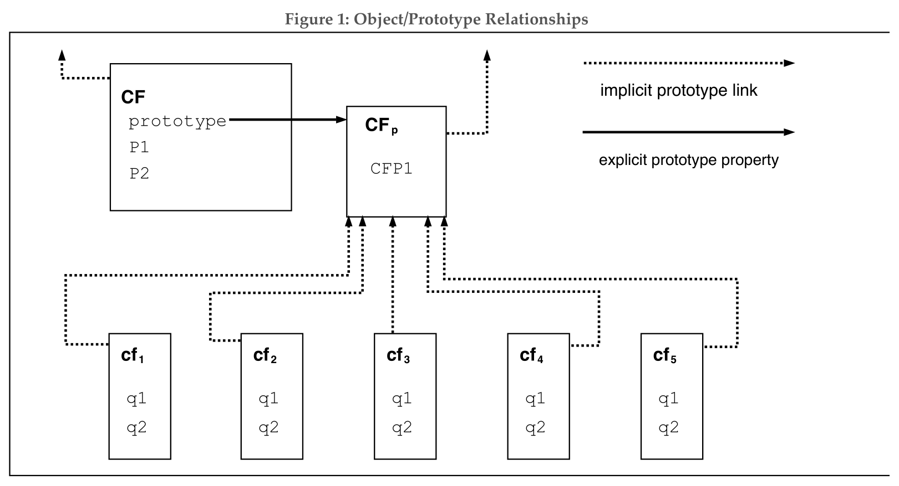

# 4.2.1 Objects 对象

Even though ECMAScript includes syntax for class definitions, ECMAScript objects are not fundamentally class-based such as those in C++, Smalltalk, or Java. Instead objects may be created in various ways including via a literal notation or via constructors which create objects and then execute code that initializes all or part of them by assigning initial values to their properties. Each constructor is a function that has a property named **"prototype"** that is used to implement *prototype-based inheritance* and *shared properties*. Objects are created by using constructors in **new** expressions; for example, **new Date(2009, 11)** creates a new Date object. Invoking a constructor without using new has consequences that depend on the constructor. For example, **Date()** produces a string representation of the current date and time rather than an object.

尽管ECMAScript包括定义class的语言，但从根本上来说，ECMAScript的对象是不像C++，Smalltalk或者Java那样基于class的。取而代之的，对象可以通过各种方式创建。包括通过字面量表示法或构造器。然后运行代码初始化其全部或部分属性值，每个构造器都是一个拥有名为**prototype**属性的函数，用来实现基于*基于原型的继承*和*共享属性*。对象是通过new表达式使用构造函数创建的；例如，**new Date(2009, 11)**创建了一个新的日期对象。不使用new调用构造器的结果取决于构造器。例如，**Date()**会生成一个表示当前日期和时间的字符串而不是Date对象。

Every object created by a constructor has an implicit reference (called the object's *prototype*) to the value of its constructor's **"prototype"** property. Furthermore, a prototype may have a non-null implicit reference to its prototype, and so on; this is called the *prototype chain*. When a reference is made to a property in an object, that reference is to the property of that name in the first object in the prototype chain that contains a property of that name. In other words, first the object mentioned directly is examined for such a property; if that object contains the named property, that is the property to which the reference refers; if that object does not contain the named property, the prototype for that object is examined next; and so on.

每个由构造器创建的对象，都有一个隐式引用（叫做对象的*原型*）指向到构造器的*prototype*属性值。此外，原型可能有一个非空的隐式引用指向到它自己的原型，以此类推，这被称为*原型链*。当引用对象的一个属性时，引用会指向原型链中第一个包含此属性名的对象的对应属性。换句话说，首先检查对象的同名属性，如果对象包含同名的属性，引用即指向此属性，如果该对象不包含同名的属性，则下一步检查对象的原型；以此类推。

In a class-based object-oriented language, in general, state is carried by instances, methods are carried by classes, and inheritance is only of structure and behaviour. In ECMAScript, the state and methods are carried by objects, while structure, behaviour, and state are all inherited.

在基于类的面向对象语言，通常情况下，实例拥有状态，类拥有方法，并且只能继承结构和行为。在ECMAScript中，对象拥有状态和方法，并且结构、行为、状态全都可继承。

All objects that do not directly contain a particular property that their prototype contains share that property and its value. Figure 1 illustrates this:

原型相同的对象，如果都不包含原型的某一属性，则它们将共享这一属性和属性值，Figure 1图示说明了这一点：

CF is a constructor (and also an object). Five objects have been created by using new expressions: cf1, cf2, cf3, cf4, and cf5. Each of these objects contains properties named q1 and q2. The dashed lines represent the implicit prototype relationship; so, for example, cf3 's prototype is CFp . The constructor, CF, has two properties itself, named P1 and  P2, which are not visible to CFp, cf1, cf2, cf3, cf4, or cf5. The property named CFP1 in CFp is shared by cf1, cf2, cf3, cf4, and cf5(but not by CF), as are any properties found in CFp 's implicit prototype chain that are not named q1, q2, or CFP1. Notice that there is no implicit prototype link between CF and CFp.

CF是一个构造器（也是一个对象）。五个对象通过new表达式创建：cf1、cf2、cf3、cf4、cf5。每个对象都有名为q1和q2的属性。虚线表示隐式原型关系；例如：cf3的原型是CFp。构造器CF自己有名为P1和P2的两个属性，这对CFp、cf1、cf2、cf3、cf4、cf5是不可见的。CFp的名为CFP1的属性共享给cf1, cf2, cf3, cf4, cf5（没有CF），另外在CFp的隐式原型链中找不到任何名为q1、q2或CFP1的属性。此外注意，CF和CFp之间没有隐式原型链接。

Unlike most class-based object languages, properties can be added to objects dynamically by assigning values to them. That is, constructors are not required to name or assign values to all or any of the constructed object's properties. In the above diagram, one could add a new shared property for cf1, cf2, cf3, cf4, and cf5 by assigning a new value to the property in CFp.

（ECMAScript）和大多数基于类的面向对象语言不同，属性可以通过赋值的方式动态的添加给对象。也就是说，构造器并不是非要对构造出的对象的全部或任何属性命名或赋值。上图中，可以给通过给CFp添加新属性值的方式为cf1, cf2, cf3, cf4,cf5添加一个新的共享属性。

Although ECMAScript objects are not inherently class-based, it is often convenient to define class-like abstractions based upon a common pattern of constructor functions, prototype objects, and methods. The ECMAScript built-in objects themselves follow such a class-like pattern. Beginning with ECMAScript 2015, the ECMAScript language includes syntactic class definitions that permit programmers to concisely define objects that conform to the same class-like abstraction pattern used by the built-in objects.

尽管ECMAScript对象本质上不是基于类的，但是基于普通模式的构造函数、原型对象和方法定义类似类的抽象很方便。ECMAScript内置对象本身遵循类似类的模式。从ECMAScript2015（ES6）开始，ECMAScript语言包括class定义语法，允许程序员简洁地定义符合内置对象所使用的类似抽象模式的对象。