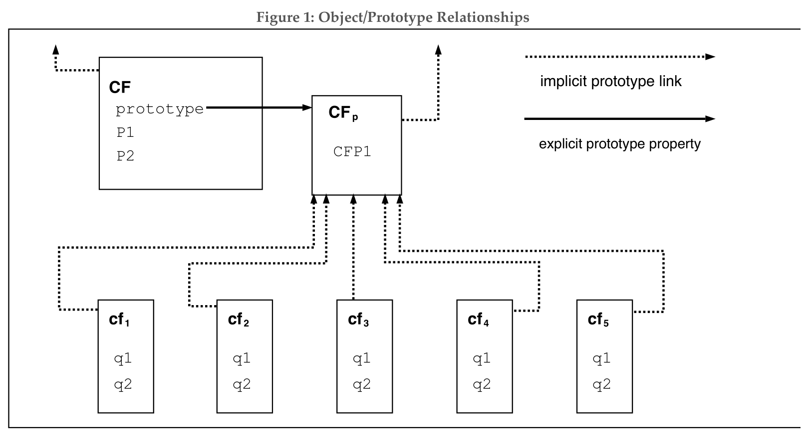

# 4.2.1 Objects 对象

Even though ECMAScript includes syntax for class definitions, ECMAScript objects are not fundamentally class-based such as those in C++, Smalltalk, or Java. Instead objects may be created in various ways including via a literal notation or via constructors which create objects and then execute code that initializes all or part of them by assigning initial values to their properties. Each constructor is a function that has a property named **"prototype"** that is used to implement *prototype-based inheritance* and *shared properties*. Objects are created by using constructors in **new** expressions; for example, **new Date(2009, 11)** creates a new Date object. Invoking a constructor without using new has consequences that depend on the constructor. For example, **Date()** produces a string representation of the current date and time rather than an object.

Every object created by a constructor has an implicit reference (called the object's *prototype*) to the value of its constructor's **"prototype"** property. Furthermore, a prototype may have a non-null implicit reference to its prototype, and so on; this is called the *prototype chain*. When a reference is made to a property in an object, that reference is to the property of that name in the first object in the prototype chain that contains a property of that name. In other words, first the object mentioned directly is examined for such a property; if that object contains the named property, that is the property to which the reference refers; if that object does not contain the named property, the prototype for that object is examined next; and so on.

In a class-based object-oriented language, in general, state is carried by instances, methods are carried by classes, and inheritance is only of structure and behaviour. In ECMAScript, the state and methods are carried by objects, while structure, behaviour, and state are all inherited.

All objects that do not directly contain a particular property that their prototype contains share that property and its value. Figure 1 illustrates this: